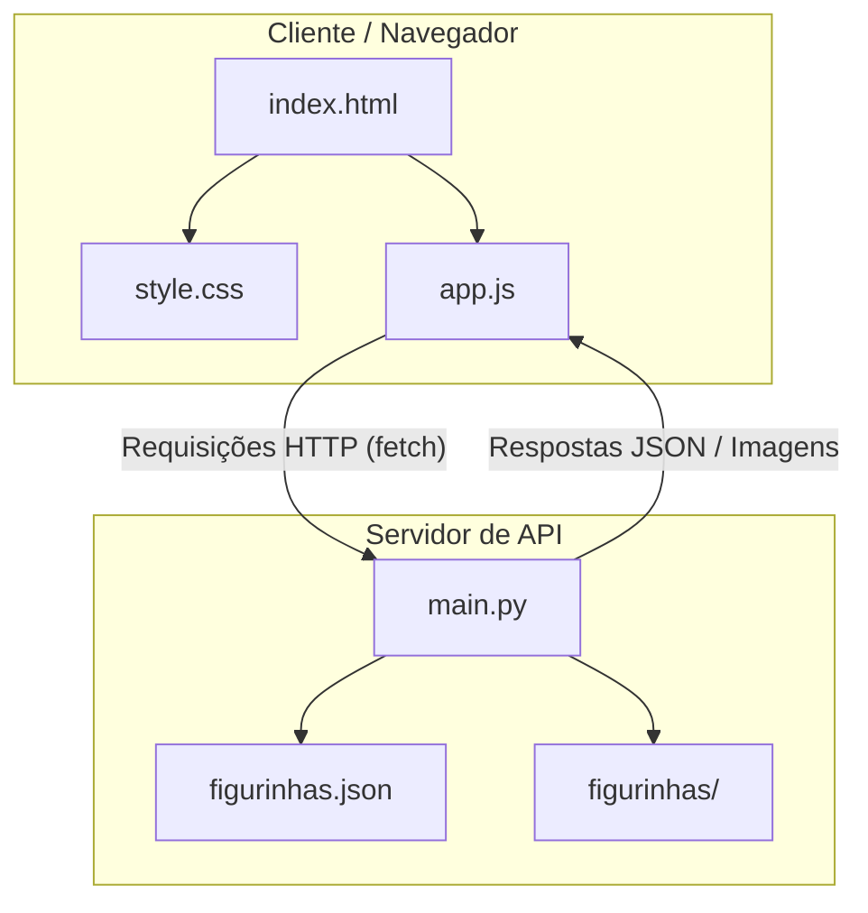

# Cultura Pop - Álbum de Figurinhas Interativo

Este é o repositório principal do **Alura Album**, uma aplicação web moderna e interativa que simula a experiência física de colecionar figurinhas em 3D. O álbum homenageia os principais ícones e pioneiros da cultura pop (música, cinema e séries) e calcula o progresso de preenchimento dinamicamente.

---

## 🏛️ Arquitetura do Projeto

O projeto é estruturado seguindo um modelo **Client-Server (Cliente-Servidor)** simplificado:



- **Frontend**: Uma interface de usuário puramente estática construída com HTML5 semântico, CSS3 personalizado para renderização e virada de página em 3D, e JavaScript Vanilla para consultar a API e povoar dinamicamente os slots de figurinha.
- **Backend**: Um servidor HTTP baseado em FastAPI (Python) que atua como fornecedor de dados e imagens. Ele também calcula as estatísticas gerais do álbum e envia de forma eficiente as imagens do disco como resposta de arquivo.

---

## 📂 Estrutura de Pastas e Arquivos

Abaixo está o mapeamento detalhado da estrutura do projeto na raiz:

```
i-arq-ia-alura-album-main/
│
├── backend/                  # Código e recursos do servidor da API
│   ├── .venv/                # Ambiente virtual Python
│   ├── figurinhas/           # Repositório de imagens estáticas das figurinhas
│   ├── main.py               # Servidor FastAPI principal (definição das rotas)
│   ├── figurinhas.json       # Banco de dados em formato JSON das 30 figurinhas
│   └── README.md             # Documentação específica do backend
│
├── frontend/                 # Interface do usuário (Cliente)
│   ├── index.html            # Estrutura HTML das páginas e slots do álbum
│   ├── style.css             # Estilos visuais e transições 3D
│   ├── app.js                # Lógica JavaScript para buscar figurinhas e virar páginas
│   └── README.md             # Documentação do frontend
│
├── .gitignore                # Regras de exclusão de arquivos para o Git
└── README.md                 # Esta documentação do projeto completo
```

### Detalhes das Pastas

#### 💻 [Frontend]
* **[index.html]**: Define a estrutura semântica do álbum (lombada, capa, contracapa e grade de slots numerados de `#01` a `#30`).
* **[style.css]**: Implementa o design moderno, as sombras e os efeitos 3D que conferem profundidade à simulação do álbum real.
* **[app.js]**: Controla a inicialização da biblioteca de virar páginas (`PageFlip`) e realiza chamadas assíncronas ao backend para obter e renderizar as figurinhas.

#### ⚙️ [Backend]
* **[main.py]**: Define o servidor, middlewares de CORS (permitindo comunicação de qualquer origem) e expõe os endpoints `/figurinhas`, `/figurinhas/total`, `/figurinhas/{id}` e `/figurinhas/{id}/imagem`.
* **[figurinhas.json]**: Fonte de verdade estruturada para todas as 30 figurinhas (com IDs, nomes, categorias e caminhos dinâmicos).
* **[figurinhas/]**: Diretório contendo os arquivos físicos das imagens que serão servidas dinamicamente pela API.

---

## 🚀 Como Executar o Projeto Completo

### 1. Executar o Backend
Abra um terminal no diretório `backend/` e inicie o servidor:
```bash
.venv\Scripts\uvicorn main:app --reload
```
A API estará de prontidão em: **`http://127.0.0.1:8000`**

### 2. Executar o Frontend
Basta abrir o arquivo **`frontend/index.html`** diretamente em qualquer navegador moderno ou usar uma extensão de servidor local de sua IDE (como o *Live Server* no VS Code).

O frontend irá automaticamente carregar e preencher os slots das figurinhas solicitando os dados ao backend em execução.
